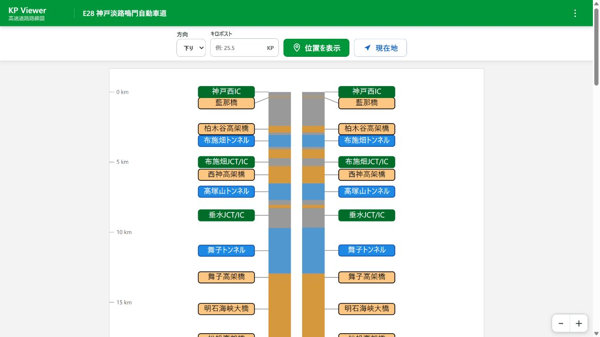
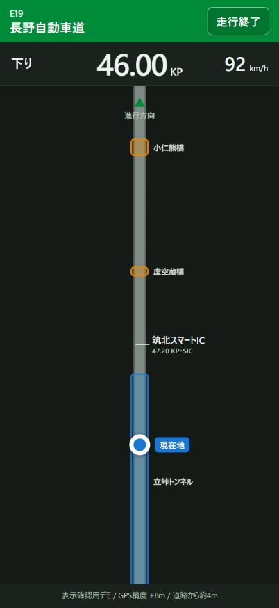
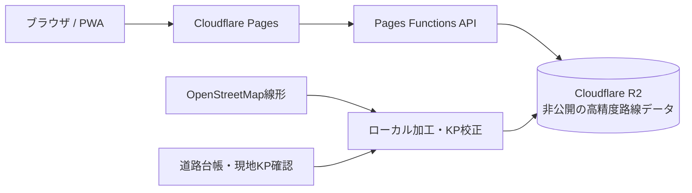

# Highway KP Viewer

高速道路を「地図上の線」ではなく、**キロポスト（KP）に沿った縦長の路線図**として見るWebアプリです。IC・JCT・SA/PA・橋梁・トンネルの位置関係を把握し、指定KPの地点をGoogle Street Viewで開けます。

[公開サイトを開く](https://highway-kp-viewer.pages.dev/) · 現在の版: `26.0.0-beta.1`



## 何ができるか

- 路線と上下線（内外回り・東西行などを含む）を選び、KPを指定して位置を表示
- IC・JCT・SA・PA、橋梁、トンネルを路線図上で確認
- 指定地点をGoogle Street Viewで開く
- GPSから近い収録路線、方向、KP、道路からの距離を推定
- 走行中向けの専用画面で、KP・速度・方向を大きく連続表示
- 複数のKP体系を持つ路線、未開通区間、不連続区間、管理事務所スコープに対応
- スマートフォン、PWA、ダークモードに対応

走行モードはGPSを定期取得し、取得間は直前の速度・方位からKP表示を補間します。



## デモを開く

すべてE28またはE30の収録データを使用します。

- [E28 神戸淡路鳴門自動車道・全線](https://highway-kp-viewer.pages.dev/viewer.html?route=e28&portal=honshi)
- [E30 瀬戸中央自動車道・全線](https://highway-kp-viewer.pages.dev/viewer.html?route=e30&portal=honshi)
- [E28 神戸管理センター区間](https://highway-kp-viewer.pages.dev/viewer.html?route=e28&scope=honshi-kobe-office&portal=honshi)
- [E28 鳴門管理センター区間](https://highway-kp-viewer.pages.dev/viewer.html?route=e28&scope=honshi-naruto-office&portal=honshi)
- [E30 坂出管理センター区間](https://highway-kp-viewer.pages.dev/viewer.html?route=e30&scope=honshi-sakaide-office&portal=honshi)
- [E28 GPSデバッグ入力付きビューア](https://highway-kp-viewer.pages.dev/viewer.html?route=e28&portal=honshi&debugGps=1)
- [E28 走行モード表示デモ（50.0KP）](https://highway-kp-viewer.pages.dev/drive.html?route=e28&portal=honshi&demo=1&demoKp=50)

走行モード表示デモはGPSを取得せず、画面確認用の固定値を表示します。

## 3分で説明すると

高速道路の設備資料はKPで場所を表すことが多い一方、一般的な地図は緯度・経度が中心です。本アプリは、道路線形に沿った距離と公式資料・現地表示から得た基準点を組み合わせ、**KPと緯度経度を相互に扱える表示・検索基盤**にしています。

主な利用イメージは次の3つです。

1. 「E28の50.0KP」のような位置を、路線上の施設や構造物と一緒に確認する
2. GPS位置から、走行中の路線・方向・KPを推定する
3. 管理事務所などの担当区間だけに絞った入口から同じビューアを利用する

## 構成



- フロントエンド: HTML / CSS / Vanilla JavaScript
- 配信・API: Cloudflare Pages / Pages Functions
- 非公開データ: Cloudflare R2
- 元線形: OpenStreetMapを加工し、手作業の基準点でKPを校正

## 公開リポジトリの位置づけ

このリポジトリは、UI・API実装・データモデルを説明できる**公開用ソーススナップショット**です。公開サイトの自動デプロイ元ではなく、更新は節目ごとに反映します。

高精度路線データは制作物の中核であるため、次のファイルは含みません。

- `data/e*/road.json`
- `data/e*/route.geojson` および補正済みGeoJSON
- KPキャリブレーション点
- OSMの取得・中間・加工済みデータ

そのため、このリポジトリ単体では公開サイトと同じ路線検索結果を再現できません。ブラウザへは路線全体のGeoJSONを配布せず、APIが必要な座標や表示情報を返します。

## APIの例

公開環境では同一オリジンの `/api` を使用します。

```text
GET /api/route/e28
GET /api/position?route=e28&direction=down&kp=50.0
GET /api/nearest?route=e28&lat=34.38&lon=134.84&heading=200&speed=25&accuracy=12
```

`/api/nearest` は `route` を省略すると収録路線全体から候補を検索し、最有力候補に加えて代替候補と判定差を返します。方位・速度・GPS精度が渡された場合は、上下線や内外回りなどの方向判定にも利用します。

APIの詳細は [API仕様書](docs/route-search-api.md) を参照してください。

## ディレクトリ概要

```text
css/                 画面スタイル
js/                  ビューアと走行モードのクライアント処理
functions/api/       Cloudflare Pages Functions
lib/                 KP変換・路線探索などの共通ロジック
data-model/          公開可能なデータ構造の説明
data/                路線一覧・ポータル構成など（高精度路線データを除く）
portals/             全国版、会社・支社・管理事務所別の入口
scripts/             検証・公開ビルド補助
```

## 公開スナップショットのビルド

Node.js 18以降で実行します。外部パッケージのインストールは不要です。

```bash
npm run build
```

生成物は `dist/` に出力されます。非公開の路線データを含まないため、ポータルやUIシェルの確認用です。実データを必要とするAPI呼び出しは、R2バインディングを持つ公開環境で動作します。

## データと精度について

- 路線線形の基礎に© OpenStreetMap contributorsのデータを利用しています（ODbL）
- 施設・構造物・KPは、道路管理者の公開資料や現地表示等を参照して整備しています
- Google Street ViewはGoogle LLCが提供する外部サービスです。本プロジェクトはGoogleと提携・承認関係にありません
- 表示値は参考情報です。工事、規制、測量、保守など正確性が必要な用途では、必ず道路管理者の最新資料を確認してください

地図・航空写真・Street Viewを印刷、配布、転載またはデータ作成に使う場合は、サービスごとの条件が異なります。本プロジェクトの運用方針と確認表は [地図コンテンツ利用ガイド](docs/map-content-usage.md) にまとめています。

## ライセンス

Copyright © 2026 shoxtechlab. All Rights Reserved.

ソースコードおよび独自データの無断複製・再配布・商用利用・改変利用は許可していません。OpenStreetMapなど第三者由来のデータには、それぞれの権利・ライセンスが適用されます。詳細は [LICENSE](LICENSE) を参照してください。
