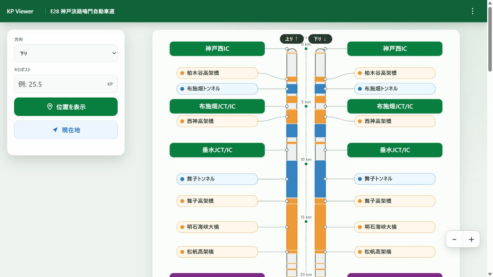
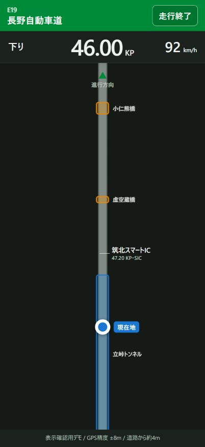
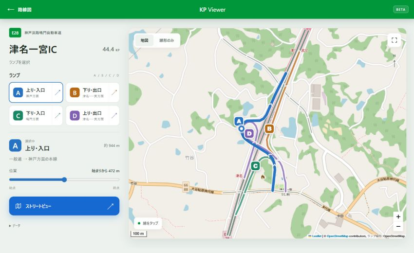
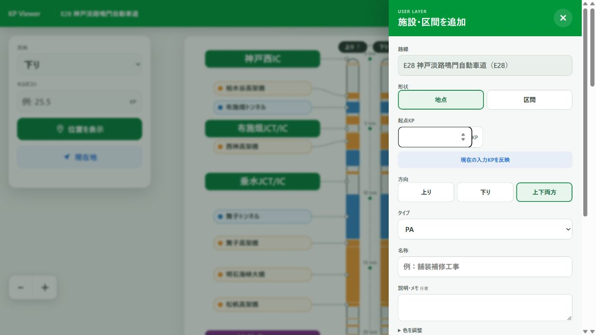
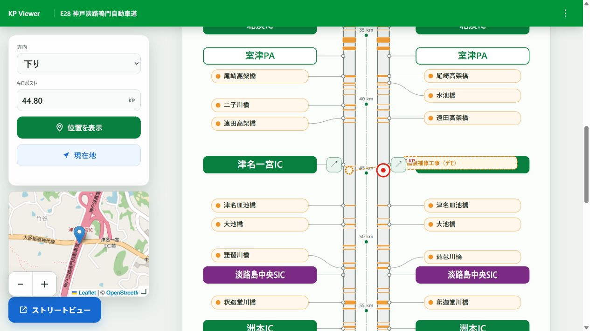
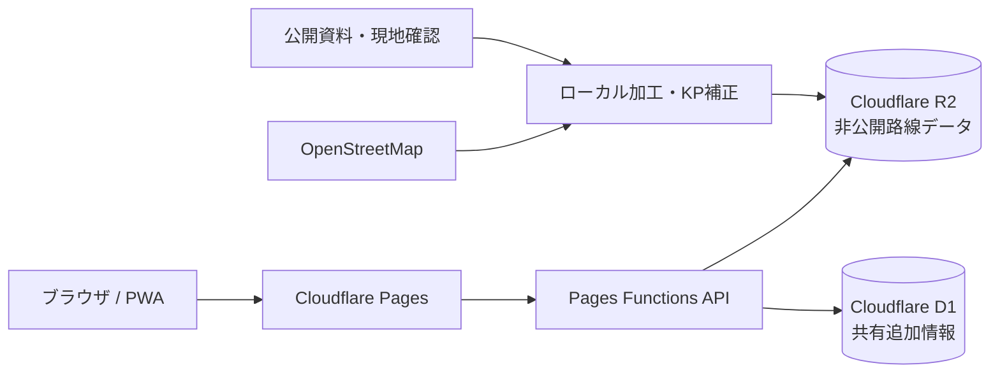

# Highway KP Viewer

高速道路の位置を、緯度・経度ではなくキロポスト（KP）を基準に確認するWebアプリケーションです。路線全体の施設・構造物を縦長の路線図にまとめ、指定KP、現在地、ICランプ、現場メモを一つの画面体系で扱います。

[公開サイトを開く](https://highway-kp-viewer.pages.dev/) · 現在の版: `26.0.0-beta.2`



## 1. 利用目的

一般的な地図は地理的な位置関係の把握に優れています。一方、高速道路の点検、施設管理、工事、事故対応では「○○道 50.0KP」のように、路線とKPで場所を扱う場面が多くあります。

Highway KP Viewerは、次の確認を短い操作で行えるようにします。

- KPを入力して、路線上の位置と周辺施設を確認する
- IC・JCT・SA・PA、橋梁、トンネルの並びを俯瞰する
- 指定地点をGoogle Street Viewで開く
- GPSから路線、方向、KP、道路からの距離を推定する
- 管理事務所など、担当区間に限定した表示を利用する

## 2. 基本操作

### 2.1 路線とKPを指定する

路線を選び、方向とKPを指定すると該当位置へ移動します。路線ごとの呼称に合わせて、上り・下りのほか、東行・西行、内回り・外回りにも対応します。


複数の道路名やKP体系を含む路線、不連続区間、未開通区間も同じビューアで扱います。収録範囲外のKPは、意図しない地点へ丸めず範囲外として通知します。

### 2.2 現在地と走行状況を確認する

現在地取得では、GPS位置に近い収録路線と方向を判定し、KPへ変換します。走行モードではKP・速度・方向を大きく表示し、GPS取得間は直前の速度と方位から表示を補間します。



### 2.3 ICランプを確認する

対応するICでは、路線図からランプ詳細へ移動できます。ランプ線形を色分けし、個別のランプからStreet Viewを開けます。



### 2.4 地点・区間情報を追加する

ケバブメニューから編集モードを開き、工事、事象、設備、メモなどをKPに重ねられます。基礎となるIC・橋梁・トンネルとは別レイヤーで管理するため、確認済みデータを変更しません。



追加情報は地点または区間、方向、種別、表示期限を指定できます。端末内だけに保存する個人情報と、管理者が全利用者へ共有する情報を分けて扱います。



## 3. 提供機能

| 分類 | 主な機能 |
| --- | --- |
| 路線表示 | KP軸、方向別線形、施設、橋梁、トンネル、未開通・不連続区間 |
| 位置検索 | KP→座標、GPS→路線・方向・KP、近接路線候補 |
| 現地確認 | Google Street Viewへの遷移、ミニマップ |
| 走行支援 | 継続GPS、速度・方位表示、取得間のKP補間 |
| 区間表示 | 全国、道路会社、支社、管理事務所、管理センター別入口 |
| 追加情報 | 個人メモ、管理者共有、期限、種別フィルター、競合検出 |
| 利用環境 | スマートフォン、PC、PWA、ダークモード |

## 4. デモ

- [E28 神戸淡路鳴門自動車道](https://highway-kp-viewer.pages.dev/viewer.html?route=e28&portal=honshi)
- [E30 瀬戸中央自動車道](https://highway-kp-viewer.pages.dev/viewer.html?route=e30&portal=honshi)
- [E28 神戸管理センター区間](https://highway-kp-viewer.pages.dev/viewer.html?route=e28&scope=honshi-kobe-office&portal=honshi)
- [E28 鳴門管理センター区間](https://highway-kp-viewer.pages.dev/viewer.html?route=e28&scope=honshi-naruto-office&portal=honshi)
- [E30 坂出管理センター区間](https://highway-kp-viewer.pages.dev/viewer.html?route=e30&scope=honshi-sakaide-office&portal=honshi)
- [E28 GPSデバッグ入力付き](https://highway-kp-viewer.pages.dev/viewer.html?route=e28&portal=honshi&debugGps=1)
- [E28 走行モード表示デモ](https://highway-kp-viewer.pages.dev/drive.html?route=e28&portal=honshi&demo=1&demoKp=50)
- [津名一宮IC ランプ詳細](https://highway-kp-viewer.pages.dev/prototypes/ic-ramps/?ic=tsuna-ichinomiya&returnTo=%2Fviewer%3Froute%3De28%26portal%3Dhonshi)

走行モード表示デモはGPSを取得せず、画面確認用の固定値を表示します。

## 5. データと利用上の注意

路線形状の基礎にはOpenStreetMap（OSM）を利用し、対象路線の抽出、方向別経路の構成、距離計算、KP基準点による補正を行っています。OSMの形状だけで正式な道路KPを確定することはできません。

- 表示値は参考情報です
- 工事、規制、測量、保守などでは道路管理者の最新資料を優先してください
- Google Street ViewはGoogle LLCの外部サービスです。本プロジェクトとの提携・承認関係はありません
- OSM由来データにはODbLと帰属表示が適用されます

詳細は[OpenStreetMap由来の路線データ](docs/osm-derived-route-data.md)と[地図コンテンツ利用ガイド](docs/map-content-usage.md)を参照してください。

## 6. 今後の拡張

- 収録路線と管理区間の拡大
- 車線数、規制方向、設備属性を使った表示の高度化
- IC・JCTランプ詳細の対応範囲拡大
- 特殊KP、南北別KP、未開通区間を含む複雑なKP体系への対応
- 走行履歴を利用した位置推定の安定化
- 一時情報の承認・配信運用と外部システム連携
- キャリブレーション候補の自動検出と品質評価
- オフライン利用範囲の拡大

---

## 7. システム構成

ここからは開発者向けの情報です。


```mermaid
flowchart LR
  U[ブラウザ / PWA] --> P[Cloudflare Pages]
  P --> F[Pages Functions API]
  F --> R[(Cloudflare R2\n非公開路線データ)]
  F --> D[(Cloudflare D1\n共有追加情報)]
  O[OpenStreetMap] --> C[ローカル加工・KP補正]
  M[公開資料・現地確認] --> C
  C --> R
```

- フロントエンド: HTML / CSS / Vanilla JavaScript
- 配信: Cloudflare Pages
- API: Cloudflare Pages Functions
- 路線データ: Cloudflare R2
- 共有追加情報: Cloudflare D1
- 線形加工: `tools/osm-kp/`

ブラウザへ路線全体の高精度GeoJSONは配布せず、APIが表示または座標変換に必要な結果を返します。

## 8. API

```text
GET /api/route/e28
GET /api/position?route=e28&direction=down&kp=50.0
GET /api/nearest?route=e28&lat=34.38&lon=134.84&heading=200&speed=25&accuracy=12
```

`/api/nearest`で`route`を省略すると、収録路線全体から最有力候補と代替候補を返します。方向は内部値の`up`・`down`に加え、路線別の表示名を`directionLabel`として返します。

KPから座標を求める処理と、現在地を路線へ射影してKPを求める処理は、模式図と実装コードを[KP・座標変換アルゴリズム](docs/kp-coordinate-algorithms.md)にまとめています。

## 9. 公開スナップショットの確認

```powershell
npm run dev
```

Node.js 18以降で`npm run build`を実行すると、公開可能なUIとAPIコードを`dist/`へ出力します。高精度路線データは含まれないため、このリポジトリ単体では公開サイトと同じ座標検索結果を再現できません。

主なディレクトリは次のとおりです。

```text
css/                 画面スタイル
js/                  ビューアと走行モード
functions/api/       Cloudflare Pages Functions
lib/                 KP変換・路線探索の共通ロジック
data-model/          公開可能なデータ構造
portals/             会社・支社・管理事務所別の入口
prototypes/ic-ramps/ 公開承認済みのICランプページ
migrations/          共有追加情報用D1スキーマ
```

## 10. リポジトリと公開範囲

このリポジトリは、UI、APIインターフェース、公開可能なデータモデルを説明する公開用スナップショットです。公開サイトの自動デプロイ元ではなく、節目ごとに更新します。

次の情報は公開しません。

- 高精度な`road.json`・`route.geojson`
- KPキャリブレーション点
- OSMの中間生成物と路線別加工設定
- 詳細な抽出・補正手順

## 11. 技術資料

- [データモデル](data-model/README.md)
- [路線・KP検索API](docs/route-search-api.md)
- [ICランプ詳細の実装](docs/ic-ramp-pages.md)
- [追加地点・区間の保存と共有](docs/user-annotations.md)
- [OSM由来データの公開方針](docs/osm-derived-route-data.md)
- [KP・座標変換アルゴリズム](docs/kp-coordinate-algorithms.md)

## 12. ライセンス

Copyright © 2026 shoxtechlab. All Rights Reserved.

書面による事前の許可なく、利用、複製、改変、再配布、派生物の作成、販売その他の商用利用を行うことはできません。第三者のソフトウェアおよびデータには、それぞれのライセンスが適用されます。詳細は[LICENSE](LICENSE)を参照してください。
