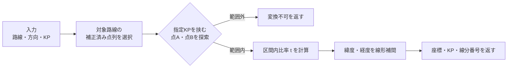
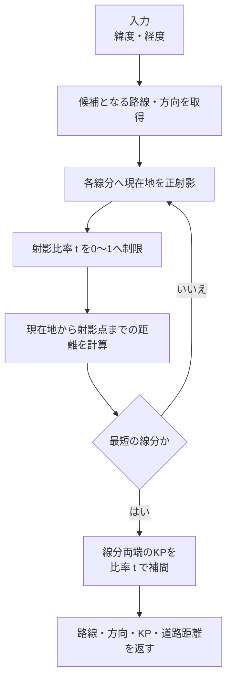
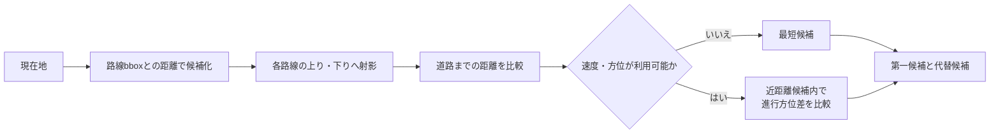

# KP・座標変換アルゴリズム

Highway KP ViewerのAPIは、補正済みの路線線形を点列として参照し、KPと緯度・経度を相互変換します。路線全体の高精度GeoJSONはブラウザへ配布せず、変換結果だけを返します。

## 1. KPから緯度・経度を求める



```text
t = (targetKP - kpA) / (kpB - kpA)
lon = lonA + (lonB - lonA) × t
lat = latA + (latB - latA) × t
```

中核実装: [`js/kpGeo.js`](../js/kpGeo.js)

```js
if (targetKP >= a.kp && targetKP <= b.kp) {
  const t = (targetKP - a.kp) / (b.kp - a.kp);

  return {
    lon: a.lon + (b.lon - a.lon) * t,
    lat: a.lat + (b.lat - a.lat) * t,
    kp: targetKP,
    chainageM: targetKP * 1000,
    segmentIndex: i,
    t
  };
}
```

単一路線は入力KPをそのまま使います。複数のKP体系を持つ路線では、通算位置から対象区間と路線KPを決定したあと、同じ補間処理へ渡します。

## 2. 現在地からKPを求める



現在地を原点とする近似平面上で、線分の端点をベクトル `A`、`B` とすると、射影比率は次の形で求めます。

```text
D = B - A
t = clamp(-(A・D) / |D|², 0, 1)
P = A + D × t
distance = |P|
KP = (chainageA + (chainageB - chainageA) × t) / 1000
```

中核実装: [`js/routeMatcher.js`](../js/routeMatcher.js)

```js
const dx = bx - ax;
const dy = by - ay;
const lengthSquared = dx * dx + dy * dy;
const t = lengthSquared > 0
  ? clamp(-(ax * dx + ay * dy) / lengthSquared, 0, 1)
  : 0;
const x = ax + dx * t;
const y = ay + dy * t;

return {
  t,
  distanceM: Math.hypot(x, y),
  lon: a.lon + (b.lon - a.lon) * t,
  lat: a.lat + (b.lat - a.lat) * t
};
```

射影位置のKPは、同じ比率`t`で両端の補正済み累積距離を補間します。

```js
const projection = projectToSegment(position, a, b);

if (!best || projection.distanceM < best.distanceM) {
  const chainageM = a.chainageM
    + (b.chainageM - a.chainageM) * projection.t;
  best = {
    kp: chainageM / 1000,
    distanceM: projection.distanceM,
    snappedLat: projection.lat,
    snappedLon: projection.lon,
    segmentIndex: i,
    segmentT: projection.t
  };
}
```

## 3. 路線と方向の選択



方位は、位置だけで十分近い候補同士の選択に限定して使います。向きが一致するだけの遠方路線を選ばないためです。APIは選択結果に加え、道路までの距離、方向判定方法、曖昧性、代替候補を返します。

## 4. 精度上の前提

- 緯度・経度の補間は、十分短い隣接線分内で行います。
- 現在地の射影では、経度方向の縮尺を緯度に応じて補正した局所平面を使います。
- KPはOSM形状から自動的に確定する値ではなく、内部で補正済みの累積距離を参照します。
- GPS誤差、上下線の近接、JCTや並行路線では候補が曖昧になる場合があります。
- APIが返すKPは0未満にならないよう公開境界で正規化します。

