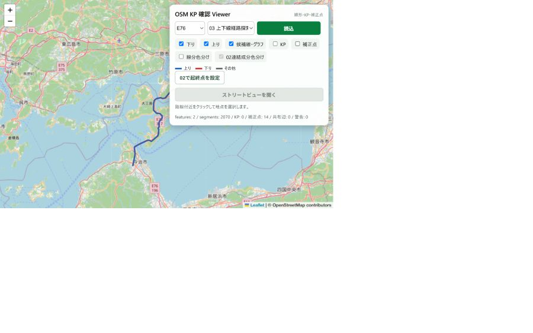

# OpenStreetMap由来の路線データについて

Highway KP Viewerでは、高速道路の形状を表現する基礎資料の一つとしてOpenStreetMap（OSM）を利用しています。

ただし、OSMから取得したデータをそのまま画面へ配信しているわけではありません。対象路線として利用できる形へ加工し、方向、接続、距離などを確認したうえで、別に確認したKP基準情報と組み合わせています。

画像は、加工結果を背景地図へ重ねて確認する内部Viewerです。公開画像では、基準点の位置を開示しないためKPと補正点を非表示にしています。

## ビューアでの利用

加工した路線データは、主に次の機能を支えています。

- 指定したKPに対応する位置を求める
- GPS位置から近い収録路線、方向、KPを推定する
- IC、JCT、SA・PA、橋梁、トンネルをKPに沿って配置する
- 対面通行、複数路線、不連続区間、未開通区間などを表現する

## 精度について

OSMの道路形状だけから、道路管理上の正式なKPを確定することはできません。そのため、公開資料や現地表示などから別に確認した情報を用いて調整しています。

表示値は参考情報です。道路管理、工事、規制、測量など正確性が必要な用途では、道路管理者の最新資料を優先してください。

## 公開範囲

公開リポジトリでは、ブラウザUI、APIのインターフェース、公開可能なデータモデルを紹介しています。

次の内容は公開していません。

- OSMデータの具体的な抽出・加工手順
- 経路、方向、接続を決める内部ロジックと設定値
- KPを調整する具体的な方法と基準点
- 途中生成物、路線別設定、加工済みの高精度GeoJSON
- 自動処理用スクリプト

高精度な路線データはCloudflare R2に非公開で保持し、ブラウザには機能ごとに必要な結果だけをAPIで返します。

公開APIで行うKPと座標の相互変換については、具体的な模式図と中核コードを[KP・座標変換アルゴリズム](kp-coordinate-algorithms.md)で公開しています。OSMの抽出・経路構成・KP補正そのものは、ここで説明する公開範囲には含めません。

## ライセンスと帰属

OSM由来データにはOpen Database License（ODbL）が適用されます。画面および関連資料では `© OpenStreetMap contributors` の帰属表示を行います。

独自の加工ロジック、画面、追加データと、OSM由来部分の権利関係は同一ではありません。社外提供、再配布、データベース公開を行う場合は、利用形態に応じてODbL上の義務を個別に確認します。

